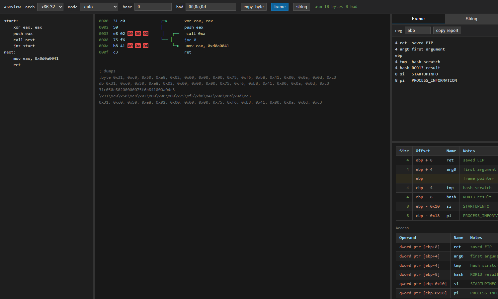

# asmview

[English](README.md) | **简体中文**

`asmview` 是一个轻量的本地 Web 工具，用于在 x86/x64 Intel 汇编与机器码之间快速转换，并辅助查看控制流、坏字符、栈帧布局和字符串编码结果。

服务只监听 `127.0.0.1`，无需前端构建，也不会把输入内容发送到外部服务。



## 功能

- 支持 x86-32 和 x86-64。
- 汇编转机器码、机器码反汇编，并可自动识别输入类型。
- 支持标签、常见 Intel 指令和 `.byte`、`.ascii`、`.asciz`、`.string`、`db/dw/dd/dq` 数据指令。
- 在反汇编列表中绘制分支跳转箭头，区分 `call`、无条件跳转和条件跳转。
- 按自定义列表高亮坏字符，默认高亮 `00`、`0a`、`0d`。
- 输出 `.byte`、`db`、连续十六进制、`\\xNN` 和逗号分隔等多种格式。
- 栈帧工具：生成偏移表、内存操作数和可复制报告。
- 字符串工具：在文本、`push imm32`、`mov [reg+off], imm32`、十六进制转义和字节数组之间互转。
- 面板尺寸可调整，布局会保存在浏览器本地存储中。

## 安装

需要 Python 3.9 或更高版本。建议使用虚拟环境。

Windows PowerShell：

```powershell
git clone https://github.com/longbenx/asmview.git
cd asmview
python -m venv .venv
.\.venv\Scripts\Activate.ps1
python -m pip install -r requirements.txt
```

Linux/macOS：

```bash
git clone https://github.com/longbenx/asmview.git
cd asmview
python3 -m venv .venv
source .venv/bin/activate
python -m pip install -r requirements.txt
```

## 启动

```bash
python asmview.py
```

然后在浏览器打开 `http://127.0.0.1:8765`。如需更换端口：

```bash
python asmview.py --port 9000
```

## 使用方法

### 汇编转机器码

选择 `x86-32` 或 `x86-64`，将 `mode` 设为 `asm -> bytes`（也可以保留 `auto`），在左侧输入：

```asm
start:
    xor eax, eax
    push eax
    jmp start
```

右侧会实时显示地址、机器码、分支箭头和反汇编结果。底部同时给出多种机器码格式；点击 `copy .byte` 可复制 `.byte` 行。

### 机器码反汇编

将 `mode` 设为 `bytes -> asm`，或在 `auto` 模式输入以下任一形式：

```text
31 c0 50 c3
31c050c3
\x31\xc0\x50\xc3
0x31, 0xc0, 0x50, 0xc3
.byte 0x31, 0xc0, 0x50, 0xc3
```

`base` 用于设置列表起始地址，例如 `0x401000`。`bad` 用于设置要高亮的字节，例如 `00,0a,0d,20`。

### 栈帧工具

点击 `frame` 打开栈帧面板。每行格式为 `大小 名称 说明`；空行、基址寄存器名或 `pivot` 表示栈帧指针位置：

```text
4 ret  saved EIP
4 arg0 first argument
ebp
4 tmp  scratch space
8 info structure
```

面板会生成相对 `ebp`/`rbp`（或自定义寄存器）的偏移和 Intel 内存操作数。点击 `copy report` 可复制 Markdown 报告。

### 字符串工具

点击 `string`，输入普通字符串或粘贴已有的 `push`、`mov`、字节数组。工具会同时生成：

- 小端序 `push imm32`；
- 写入指定寄存器和偏移的 `mov dword ptr [...]`；
- 十进制/十六进制字节数组；
- `\\xNN` 转义和空格分隔十六进制。

`nul` 控制是否追加空字节，`reg` 和 `off` 控制生成的 `mov` 目标位置。

## 测试

```bash
python -m unittest discover -s tests -v
```

## 注意事项

- 当前只支持 x86-32 与 x86-64，不支持 ARM 等架构。
- 汇编语法以 Keystone 支持的 Intel 语法为准。
- 页面不包含身份认证，请勿自行改为监听公网地址。
